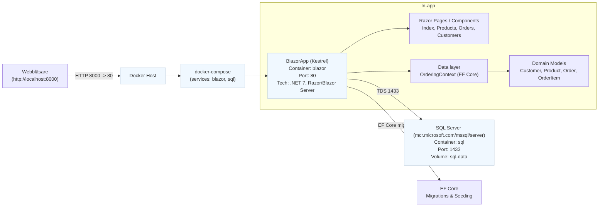
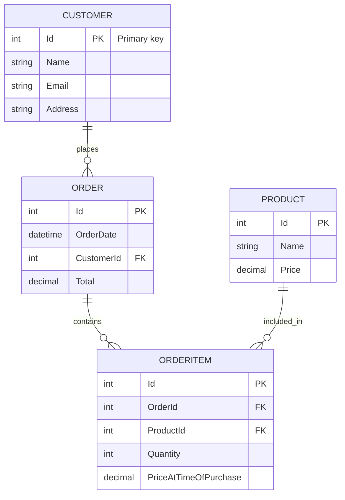

# Arkitektur & Datamodell

Den här filen beskriver projektets högnivåarkitektur och databasmodell. Diagrammen är skrivna i Mermaid (fungerar i VS Code med Mermaid-preview eller kan renderas med `@mermaid-js/mermaid-cli`).

## Systemöversikt (Mermaid flowchart)



## Databasmodell (ER-diagram)



## Förklaring

- `BlazorApp` körs i en container som exponeras via host-port `8000` (mappad till container-port `80`). I utvecklingskompositionen används `docker-compose.yml` för att starta både `blazor` och `sql`.
- `BlazorApp` använder EF Core (`OrderingContext`) för att läsa/skriva mot SQL Server-tjänsten `sql` (hostnamn `sql` i compose-nätverket).
- Migrations körs vid uppstart (Program.cs anropar `db.Database.Migrate()`), vilket skapar databasen och seedar testdata.
- Datamodellen är normaliserad (Customers, Products, Orders, OrderItems). `OrderItem.PriceAtTimeOfPurchase` bevarar produktpriset när beställningen gjordes.

## Rendera diagram

Rekommenderade sätt att se diagrammen:

- I VS Code: installera extensionen "Markdown Preview Mermaid Support" eller använd inbyggd Markdown-preview (nyare VS Code kan behöva tillägget).
- Rendera till PNG/SVG med `@mermaid-js/mermaid-cli`:

PowerShell-exempel (om du har Node.js installerat):

```powershell
# installera en gång (global eller i projekt)
npm install -g @mermaid-js/mermaid-cli

# rendera enbart Mermaid-koden från en .mmd-fil; här extraherar vi blocket manuellt eller skapa en .mmd
mmdc -i docs/architecture-system.mmd -o docs/architecture-system.png
mmdc -i docs/architecture-er.mmd -o docs/architecture-er.png
```

Tips: Om du vill att jag ska skapa färdiga `.mmd`-filer eller exportera PNG/SVG-illustrationer i repo:n så kan jag generera dem också. Vill du jag skapar PNG-filer här i projektet (kräver att `mmdc` körs lokalt eller i CI)?

---

Om du vill ha en annan vy (t.ex. sekvensdiagram, deploymentschema eller klassdiagram i mer detalj) så säg vilken vy du vill se så skapar jag den också.